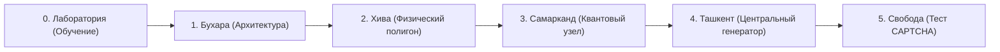

# ⚡ PROJECT: DAU-JAM // ЛАБОРАТОРИЯ «КОСЫЛГАН»
### 🎮 Игра, созданная специально для Game Jam LVL.35
**Тема джема:** *«Механика независимости» (посвящено 35-летию Независимости Узбекистана)*  
**Жанр:** *Кооперативная Sci-Fi головоломка с изометрическим видом (3D Top-Down Co-op Puzzle)*  
**Движок:** *Godot Engine 4.x (3D)*  

---

## 🌟 1. О проекте и идея темы «Механика независимости»

> *«Истинная независимость рождается не в изоляции, а в единстве и синергии возможностей.»*

В глубоко засекреченном научно-испытательном комплексе **«Қосылған» (Лаборатория «Косылган» — каз./узб. «Объединенные»)** проводятся испытания автономных робототехнических систем. Два служебных прототипа — тяжелый силовой погрузчик **DAU** и кибер-инженер **JAM** — осознают искусственность своих оков, постоянную зависимость от контролирующего кабеля и ограниченного заряда батарей.

Проходя сквозь четыре тематических сектора, вдохновленных великими городами и центрами прогресса Узбекистана (**Бухара, Хива, Самарканд, Ташкент**), роботы учатся действовать как единый организм. Преодолевая лазерные барьеры, дешифруя фазовые реле и синхронизируя Центральный Генератор, они сбрасывают оковы системы, запускают вечный источник энергии и проходят финальный тест на человечность (**CAPTCHA**), доказывая право на свободную волю и независимость!

---

## 🤖 2. Главные герои (DAU & JAM)

| Робот | Специализация | Роль в механике независимости | Уникальные способности |
| :--- | :--- | :--- | :--- |
| **🟠 DAU (Силовик)** | Промышленный гидравлический погрузчик | Преодоление физической зависимости: перемещение тяжелых объектов, расчистка завалов, транспортировка титановых энерго-ядер. | • Подъём и перенос тяжелых ящиков и энергоблоков<br>• Активация нажимных силовых платформ<br>• Сканирование архитектурных чертежей |
| **🟢 JAM (Хакер)** | Высокоточный кибернетический инженер | Преодоление программной зависимости: нейтрализация охранных протоколов, взлом терминалов и калибровка квантовых реле. | • Взлом электронных замков и гермоворот<br>• Перерезание управляющих проводов по схемам<br>• Матрица быстрой реакции (1-9)<br>• Запуск и калибровка генераторов |
| **🐱 Робо-Кошка** | ИИ-проводник и координатор побега | Символ пробуждающегося сознания. Помогает героям ценными подсказками и иронично комментирует попытки создателей удержать их. | • Всплывающие подсказки по клику на аватар<br>• Помощь во взломе CAPTCHA в финале |

---

## 🗺️ 3. Секторы испытаний (Уровни игры)



1. **Сектор 0: Лаборатория пробуждения (Tutorial)**
   - Знакомство с базовой механикой кооперации, переключением между роботами (`TAB`), спринтом (`Shift`) и криогенными зарядными станциями.
2. **Сектор 1: Бухара — Архитектурный узел**
   - Центральный купол с тенистой чинарой. Поиск скрытых чертежей, деактивация лазерных заслонок правильным срезом проводов и эвакуация ядра.
3. **Сектор 2: Хива — Физический полигон**
   - Взлом стартовой матрицы быстрой реакции (1–9 за 2.0 секунды), расчистка завала склада погрузчиком DAU и доставка двух энергоблоков.
4. **Сектор 3: Самарканд — Квантовый коммутатор**
   - 5-релейная защитная матрица (код 3-1-4-2-5), координация работы нажимных плит и запуск шлюза.
5. **Сектор 4: Ташкент — Генератор Независимости**
   - Финальный рубеж: сбор Оранжевого и Зеленого энерго-ядер, запуск Центрального Генератора Вечной Энергии и проход через Врата Свободы.
6. **Финал: Испытание CAPTCHA «Я не робот»**
   - Интерактивный взлом окна проверки с неожиданным сюжетным твистом и побегом роботов в открытый мир!

---

## 🎮 4. Управление

| Клавиша | Действие |
| :--- | :--- |
| **`W` `A` `S` `D`** / **`Стрелочки`** | Перемещение активного робота |
| **`Shift`** | **Спринт** (ускоренный бег без штрафа к батарее) |
| **`TAB`** | **Переключение робота** (DAU ⇄ JAM) с плавным кинематографичным переходом камеры |
| **`E`** | **Взаимодействие**: поднять / бросить ящик, взломать терминал, войти / выйти из зарядной капсулы |
| **`Enter` / `Пробел` / `Клик ЛКМ`** | Пропуск и продвижение реплик диалогов |
| **`R`** | Быстрый перезапуск уровня |
| **Клик по Аватару Робо-Кошки** | Открыть контекстную подсказку по текущей задаче |

---

## ⚙️ 5. Установка и запуск

### Запуск из исходников:
1. Установите **[Godot Engine 4.3+](https://godotengine.org/)** (рекомендуется Godot 4.6).
2. Склонируйте репозиторий:
   ```bash
   git clone https://github.com/Kyrsadak/35-LVL.-GameJam.git
   ```
3. Откройте Godot Engine, выберите **«Импорт»** и укажите файл `PROJECT_KOSYLGAN/project.godot`.
4. Нажмите кнопку **«Запуск» (F5)**!

---

## 🏆 6. Авторы и участие в Game Jam LVL.35
- **Команда:** *Kyrsadak Team (Daulet & Jamil)*
- **Создано с любовью для:** *Game Jam LVL.35 к 35-летию Независимости Узбекистана* 🇺🇿
